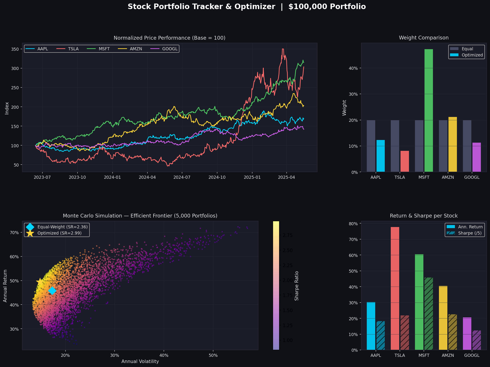

# Stock Portfolio Tracker & Optimizer

> **Finance portfolio project** — Python-based stock portfolio tracker with Sharpe Ratio optimization and Monte Carlo simulation across a $100,000 mock portfolio.

---

## 📊 Project Overview

This project builds a complete quantitative portfolio analysis tool for 5 major stocks:
**AAPL, TSLA, MSFT, AMZN, GOOGL**

It tracks performance, calculates risk-adjusted returns, optimizes portfolio weights, and visualizes the efficient frontier using Monte Carlo simulation — all skills used by real portfolio managers and quantitative analysts.

---

## 🗂️ Files

| File | Description |
|------|-------------|
| `portfolio_tracker.py` | Main Python script — runs full analysis and generates dashboard |
| `portfolio_dashboard.png` | Output chart — 4-panel visualization of results |
| `requirements.txt` | Python dependencies |

---

## 📈 What It Does

### 1. Portfolio Tracking
- Tracks a **$100,000 equal-weight portfolio** ($20,000 per stock)
- Calculates annualized return and volatility per stock
- Shows normalized price performance over 2 years (base = 100)

### 2. Risk & Return Metrics
| Metric | Description |
|--------|-------------|
| Annualized Return | Average yearly return based on daily price data |
| Annualized Volatility | Standard deviation of returns × √252 |
| Sharpe Ratio | (Return − Risk-Free Rate) / Volatility |

### 3. Sharpe Ratio Optimization
- Uses `scipy.optimize` (SLSQP method) to find the **optimal weight allocation** that maximizes the Sharpe Ratio
- Constraints: weights sum to 100%, min 5% and max 60% per stock
- Outputs rebalancing recommendations (buy/sell % per stock)

### 4. Monte Carlo Simulation
- Runs **5,000 random portfolios** with different weight combinations
- Plots the **efficient frontier** — the set of portfolios with the best return per unit of risk
- Colors each portfolio by Sharpe Ratio so the optimal zone is visible

---

## 📊 Sample Output

```
EQUAL-WEIGHT PORTFOLIO (Baseline):
  Expected Annual Return : 45.86%
  Annual Volatility      : 17.30%
  Sharpe Ratio           : 2.36

OPTIMIZED PORTFOLIO (Max Sharpe):
  Ticker   Weight   $ Allocated
  AAPL     12.3%    $12,312
  TSLA      8.1%    $ 8,088
  MSFT     47.2%    $47,216
  AMZN     21.1%    $21,134
  GOOGL    11.3%    $11,251

  Expected Annual Return : 49.42%
  Annual Volatility      : 14.84%
  Sharpe Ratio           : 2.99

Sharpe Improvement: +26.7%
```

---

## 📉 Dashboard Charts

The script generates a 4-panel dashboard saved as `portfolio_dashboard.png`:

| Panel | Description |
|-------|-------------|
| Top Left | Normalized price performance for all 5 stocks (base = 100) |
| Top Right | Equal-weight vs optimized weight comparison bar chart |
| Bottom Left | Monte Carlo efficient frontier (5,000 portfolios, colored by Sharpe) |
| Bottom Right | Annualized return and Sharpe Ratio per stock |



---

## 🚀 How to Run

```bash
# 1. Clone the repo
git clone https://github.com/YOUR_USERNAME/stock-portfolio-optimizer.git
cd stock-portfolio-optimizer

# 2. Install dependencies
pip install -r requirements.txt

# 3. Run the optimizer
python portfolio_tracker.py
```

> **Live data:** To use real stock prices instead of simulated data, replace the data section with:
> ```python
> import yfinance as yf
> raw = yf.download(["AAPL","TSLA","MSFT","AMZN","GOOGL"], period="2y", auto_adjust=True)
> prices = raw["Close"].dropna()
> ```

---

## 🛠️ Tech Stack

| Library | Purpose |
|---------|---------|
| `pandas` | Data manipulation and returns calculation |
| `numpy` | Matrix math and annualized metrics |
| `scipy` | Sharpe Ratio optimization (SLSQP solver) |
| `matplotlib` | 4-panel dashboard chart |
| `yfinance` | Live stock price data (optional) |

---

## 📚 Finance Concepts Demonstrated

- **Modern Portfolio Theory (MPT)** — diversification and the efficient frontier
- **Sharpe Ratio** — measuring risk-adjusted return
- **Monte Carlo Simulation** — probabilistic portfolio analysis
- **Portfolio Optimization** — maximizing return per unit of risk
- **Annualized Volatility** — standard deviation scaled to yearly basis

---

## ⚠️ Disclaimer

This project is for educational and portfolio purposes only. It does not constitute investment advice.

---

## 👤 Author

Likhit Ravi Kumar | Finance Student | Aspiring Financial Analyst  
[LinkedIn](https://www.linkedin.com/in/likhitkumar09/) · l_ravikumar1@u.pacific.edu
